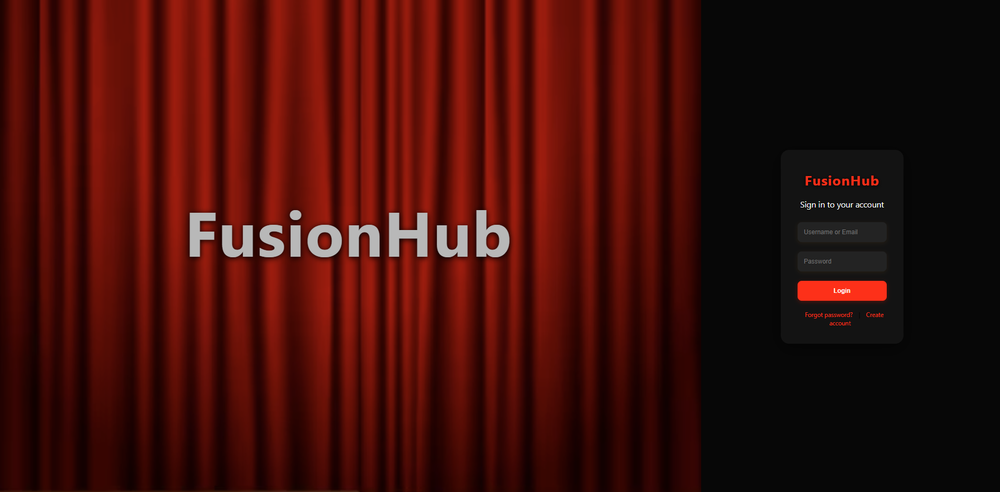
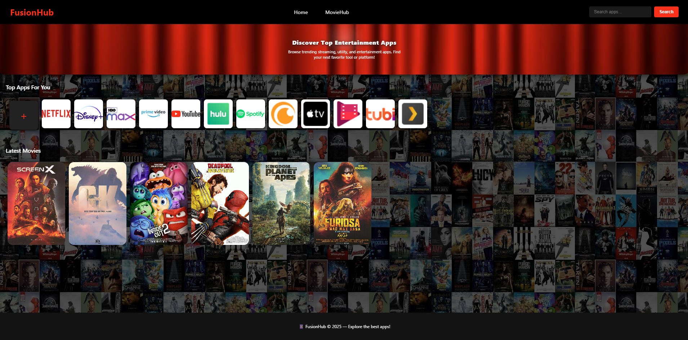
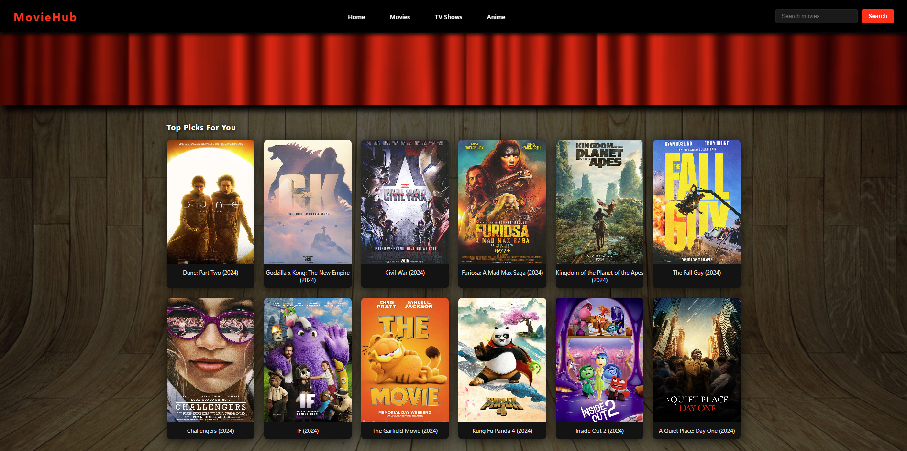

# Fusion Hub - Movies & TV Series

Copyright (c) 2025 Fusion Hub

All content, code, design, and visual elements of this project are the exclusive property of Fusion Hub.
Any unauthorized copying, distribution, modification, or use of this project, in whole or in part, is strictly prohibited without prior written permission from the owner.

To view the live website deployment on Vercel:  
[Fusion Hub Demo ](https://basic-project-with-read-me.vercel.app)

---

## About This Project

**Fusion Hub** is a modern platform designed to **browse, discover, and watch movies and TV series** in one place. This project demonstrates a sleek and interactive landing page, inspired by streaming platforms like Netflix, with a focus on simplicity and user experience.

Key highlights:

-  Browse movies and TV series with an attractive interface  
-  Organized sections for trending, popular, and recently added content  
-  Responsive design that works on desktop and mobile  
-  Lightweight and easy to customize
  
---

## Features

- Interactive **movie & TV series library**  
- Featured sections for trending or popular content  
- Modern **card-based layout**  
- Search and filter functionality (optional for MVP)  
- Smooth animations and hover effects  

---

## Technologies Used

- **HTML5 & CSS3**  
- **JavaScript** for dynamic content  
- **Responsive design principles**  

---

## Future Improvements

- Add **user authentication and watchlists**  
- Integrate with **APIs for real-time movie/TV data**  
- Implement **video previews or trailers**  
- Add **filter by genre, rating, or release date**  

---

